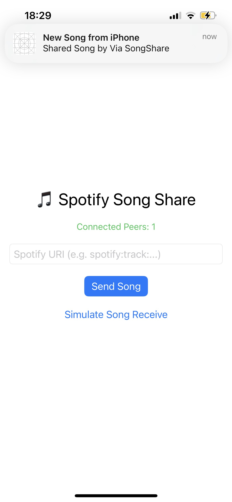
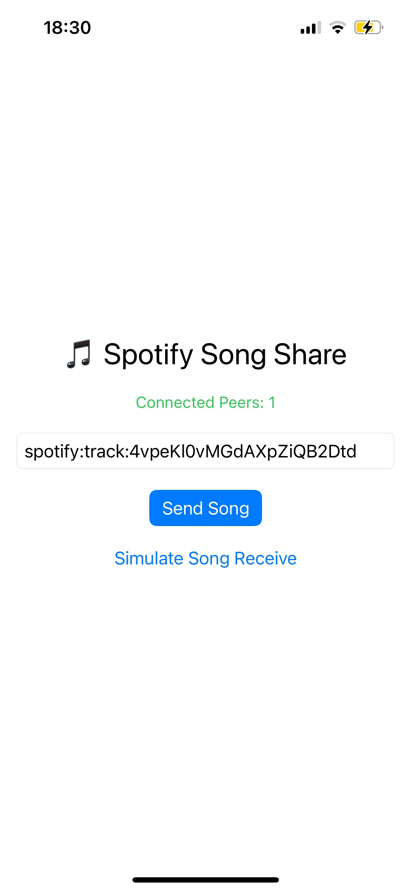

# Songshare

Swift App that allows you send notfications to nearby users taht deeplink to Spotify

## How it works

<video autoPlay loop muted playsInline style="width:200px;" >
<source src="./media/ScreenRecording_11-16-2025 18-29-42_1.mp4" /></video>

The App takes a URI which is automatically copied in if shared from within the Spotify app.

It then uses `Multipeer connectivity` to detect nearby devices who also have the app open and send push notifications to all these devices on button press.

This notification opens a deeplink tot he song in Spotify and starts it playing.

The app also includes a test notifcationa dn default song to fall back to.

## Future

It would be nice if Spotify implemented something similiar allowing user to not leave the app and share songs just by having the Spotify app open and near each other.
